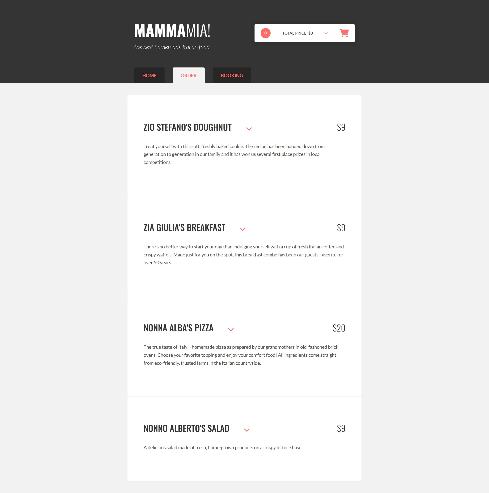
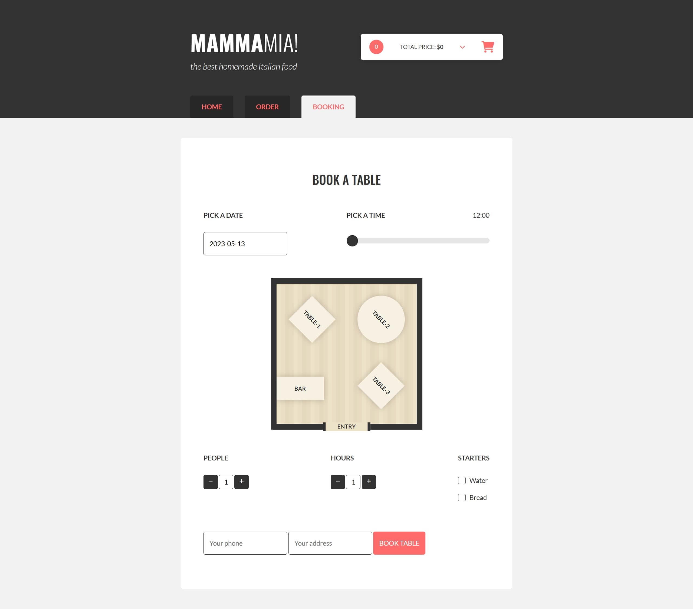

🍕 PROJECT "PIZZERIA"

Application for pizzeria, written in JavaScript. 

💻 Live demo: https://project-pizzeria-v2n2.onrender.com

(!) Free hosting so might take a while to load for first time.

✔ Used Technologies:
JavaScript,
HTML,
CSS/SASS.

➜ Features:
Order,
Booking,
WEB API.

👀 Screenshots:

📸 Home

📸 Order

📸 Booking

✉ Contact:

Created by Viktoryia Vysotskaya 

➽ radevich.vika2014@gmail.com

➽ https://www.linkedin.com/in/viktoryia-vysotskaya

version 2.4
